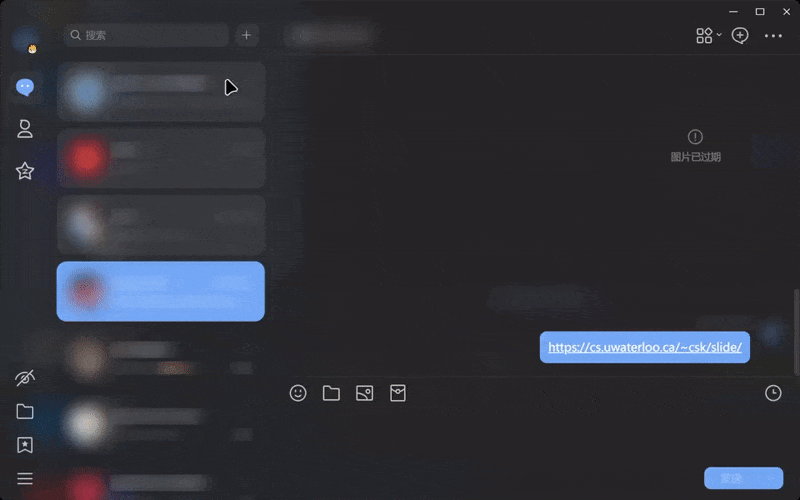

</img>

# Transitio

[LiteLoaderQQNT](https://github.com/mo-jinran/LiteLoaderQQNT) 插件，用于为 QQNT 提供一些 QOL 的**纯 CSS 实现的外观更改**。

## 具体功能

- 提供了亿些丝滑的**过渡动画** (`transition 0.2s ease-in-out`)
- 修改了图片查看器**工具栏和缩放提示的不透明度** (增加了透明度，避免引起遮挡)
- 自定义加载 CSS 代码片段

## 内置样式演示

> 演示中使用了 [MSpring-Theme](https://github.com/MUKAPP/LiteLoaderQQNT-MSpring-Theme)，主题色为 `#74A9F6`。

### 过渡动画



[Video](./attachments/transitio.mp4)

### 图片查看器工具栏


## 安装

### 插件商店

在插件商店中找到 Transitio 并安装。

### 手动安装

- 稳定版: 下载 Release 中的 `transitio-release.zip`，解压后放入[数据目录](https://github.com/mo-jinran/LiteLoaderQQNT-Plugin-Template/wiki/1.%E4%BA%86%E8%A7%A3%E6%95%B0%E6%8D%AE%E7%9B%AE%E5%BD%95%E7%BB%93%E6%9E%84#liteloader%E7%9A%84%E6%95%B0%E6%8D%AE%E7%9B%AE%E5%BD%95)下的 `plugins/transitio` 文件夹中即可。(若没有该文件夹请自行创建)
- CI 版: 若想体验最新的 CI 功能，可以下载源码后同上安装。(仅需下载下面列出的文件)

完成后的目录结构应该如下:

```
plugins (所有的插件目录)
└── transitio (此插件目录)
    ├── manifest.json (插件元数据)
    ├── main.js (插件脚本)
    ├── preload.js (插件脚本)
    ├── renderer.js (插件脚本)
    ├── icon.png (插件图标)
    ├── settings.html (插件设置界面)
    └── styles (内置/自定义样式文件夹，将会被移动至数据目录)
        ├── image-viewer.css (内置样式：图片查看器)
        └── transition.css (内置样式：过渡动画)
```

## 使用方法

> 所有不是通过配置界面进行的更改，除非打开了*开发者模式*，都会在**双击开发者模式**这行字或重启 QQ 后生效。

- 启用/禁用样式：打开插件设置界面，将对应的样式开关打开/关闭，即时生效。
    - 注意：禁用样式，实际上是在文件内第一行注释末尾添加了 `[Disabled]` 标记。
    - 若点击各个开关速度过快，可能会导致错位等情况，此时请双击开发者模式来重载。
- 导入样式：~~将 CSS 文件拖入设置窗口，或~~将之放入 `plugins_data/transitio/styles/` 文件夹。
    - CSS 文件开头的注释（若有）会被当作样式说明，显示在设置界面中。
- 删除样式：~~点击删除按钮，或~~进入 `plugins_data/transitio/styles/` 文件夹删除对应文件。
- 修改样式：修改对应文件即可。
    - 注意：请不要修改内置的样式文件，因为插件更新时会被覆盖。
