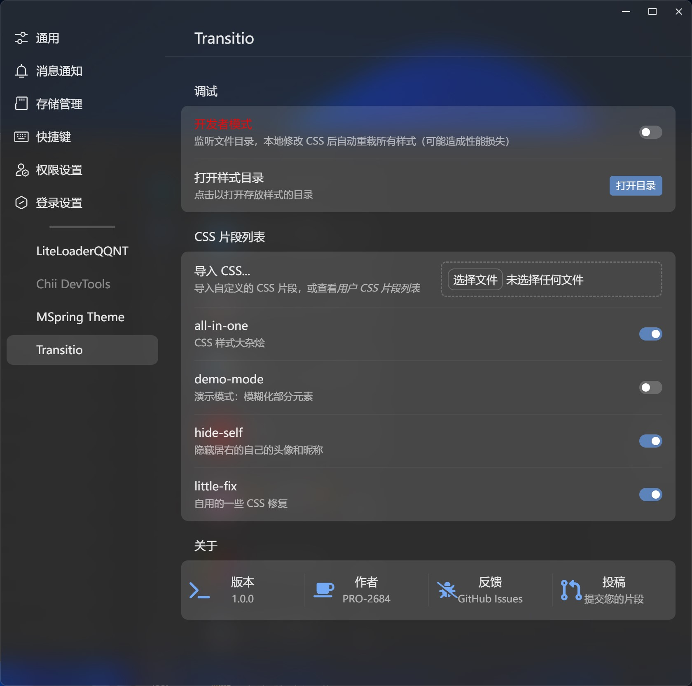

</img>

# Transitio

> [!NOTE]
> 此插件 `1.0.0` 版本及以上最低支持 LiteLoaderQQNT 1.0.0，之前版本的 LiteLoaderQQNT 请使用 `1.0.0` 之前的 Release

[LiteLoaderQQNT](https://github.com/mo-jinran/LiteLoaderQQNT) 插件，用于为 QQNT 加载任意 CSS 片段。

你可能也感兴趣：[Scriptio](https://github.com/PRO-2684/Scriptio)，自定义渲染层 JavaScript 脚本加载器。

## 🪄 具体功能

- 导入 CSS 代码片段
- 启用/禁用 CSS 代码片段
- 开发者模式：监控文件更改，实时预览效果
- 立即重载：立即重载所有 CSS 代码片段

## 🖼️ 截图

> 演示中使用了 [MSpring-Theme](https://github.com/MUKAPP/LiteLoaderQQNT-MSpring-Theme)，主题色为 `#74A9F6`。



## 📥 安装

### 插件商店

在插件商店中找到 Transitio 并安装。

### 手动安装

- 稳定版: 下载 Release 中的 `transitio-release.zip`，解压后放入[数据目录](https://github.com/mo-jinran/LiteLoaderQQNT-Plugin-Template/wiki/1.%E4%BA%86%E8%A7%A3%E6%95%B0%E6%8D%AE%E7%9B%AE%E5%BD%95%E7%BB%93%E6%9E%84#liteloader%E7%9A%84%E6%95%B0%E6%8D%AE%E7%9B%AE%E5%BD%95)下的 `plugins/transitio` 文件夹中即可。(若没有该文件夹请自行创建)
- CI 版: 若想体验最新的 CI 功能，可以下载源码后同上安装。(仅需下载下面列出的文件)

完成后的目录结构应该如下:

```
plugins (所有的插件目录)
└── transitio (此插件目录)
    ├── manifest.json (插件元数据)
    ├── main.js (插件脚本)
    ├── preload.js (插件脚本)
    ├── renderer.js (插件脚本)
    ├── settings.html (插件设置界面)
    └── icons/ (插件用到的图标)
```

## 🤔 使用方法

> [!WARNING]
> 所有不是通过配置界面进行的更改，除非打开了*开发者模式*，都只在**双击 CSS 片段列表**这行字或重启 QQ 后生效。

- 启用/禁用样式：打开插件设置界面，将对应的样式开关打开/关闭，即时生效。
    - 注意：禁用样式，实际上是在文件内第一行注释末尾添加了 `[Disabled]` 标记。
    - 若点击各个开关速度过快，可能会导致错位等情况，此时请双击 "CSS 片段列表" 来重载。
- 导入样式：在配置界面导入 CSS 文件，或将之放入 `data/transitio/styles/` 文件夹。
    - CSS 文件首行的注释（若有）会被当作样式说明，显示在设置界面中。
- 删除样式：~~点击删除按钮，或~~进入 `data/transitio/styles/` 文件夹删除对应文件。
- 修改样式：修改对应文件即可。
- 更新样式：重新导入即可。

## 💻 调试

- 开发者模式：若您想要调试**您的 CSS 片段**，可以在插件设置界面打开*开发者模式*，此时插件会监控 `data/transitio/styles/` 文件夹，当发生更改时，会自动重载。
- Debug 模式：若您想要调试**此插件本身**，可以使用 `--transitio-debug` 参数启动 QQNT，此时插件会在控制台输出调试信息。

## 📜 用户 CSS 片段

> [!NOTE]
> 以下样式均为由我/其它用户编写的 CSS 片段，不内置在插件中。
>
> 你可以下载后**修改其内容**来满足你的需求，随后将其**导入到插件中**来体验。
>
> 若你有愿意分享的样式，欢迎[提交 PR 或 Issue](https://github.com/PRO-2684/transitio/issues/4) 来将它们添加到这里。

> [!WARNING]
> 请不要在文件名中使用诸如句点 `.`, 空格 ` `, 加 `+` 等特殊字符，否则可能会导致插件无法正常工作。推荐仅使用字母、数字、下划线 `_` 与连字符 `-`。(参照 Issue [#8](https://github.com/PRO-2684/transitio/issues/8#issuecomment-1681774753))

| 名称 | 作者 | 说明 | 链接 |
| --- | --- | --- | --- |
| all-in-one | [PRO-2684](https://github.com/PRO-2684) | 大杂烩 | [GitHub](https://github.com/PRO-2684/Transitio-user-css/#all-in-one) |
| auto-fold-chat-input-area | [lamprose](https://github.com/lamprose) | 消息输入框默认折叠有文字输入时展开 | [GitHub](https://github.com/lamprose/transitio-css#auto-fold-chat-input-area) |
| demo-mode | [PRO-2684](https://github.com/PRO-2684) | [演示模式](https://github.com/qianxuu/LiteLoaderQQNT-Plugin-Demo-mode)的 CSS | [GitHub](https://github.com/PRO-2684/Transitio-user-css/#demo-mode) |
| hide-items | [PRO-2684](https://github.com/PRO-2684) | 隐藏一些元素 | [GitHub](https://github.com/PRO-2684/Transitio-user-css/#hide-items) |
| hide-self | [PRO-2684](https://github.com/PRO-2684) | 隐藏自己的头像和昵称 | [GitHub](https://github.com/PRO-2684/Transitio-user-css/#hide-self) |
| highlight-at | [PRO-2684](https://github.com/PRO-2684) | 高亮艾特 | [GitHub](https://github.com/PRO-2684/Transitio-user-css/#highlight-at) |
| image-viewer | [PRO-2684](https://github.com/PRO-2684) | 媒体查看器透明度修改 | [GitHub](https://github.com/PRO-2684/Transitio-user-css/#image-viewer) |
| message-img-transparent | [lamprose](https://github.com/lamprose) | 包含图片消息背景透明 | [GitHub](https://github.com/lamprose/transitio-css#message-img-transparent) |
| input-placeholder | [PRO-2684](https://github.com/PRO-2684) | 添加输入框提示（占位符） | [GitHub](https://github.com/PRO-2684/Transitio-user-css/#input-placeholder) |
| no-update-dialog | [PRO-2684](https://github.com/PRO-2684) | 隐藏更新提示框 | [GitHub](https://github.com/PRO-2684/Transitio-user-css/#no-update-dialog) |
| no-update-dot | [PRO-2684](https://github.com/PRO-2684) | 隐藏更新小红点 | [GitHub](https://github.com/PRO-2684/Transitio-user-css/#no-update-dot) |
| qqface-fine-tune | [PRO-2684](https://github.com/PRO-2684) | QQ 表情微调 | [GitHub](https://github.com/PRO-2684/Transitio-user-css/#qqface-fine-tune) |
| SimSun-font | [shiquda](https://github.com/shiquda) | 使用宋体字体 | [GitHub](https://github.com/shiquda/Transitio-user-css/#SimSun-font.css)
| transition | [PRO-2684](https://github.com/PRO-2684) | 添加过渡动画 | [GitHub](https://github.com/PRO-2684/Transitio-user-css/#transition) |
| transparent | [PRO-2684](https://github.com/PRO-2684) | 透明化部分元素 | [GitHub](https://github.com/PRO-2684/Transitio-user-css/#transparent) |
